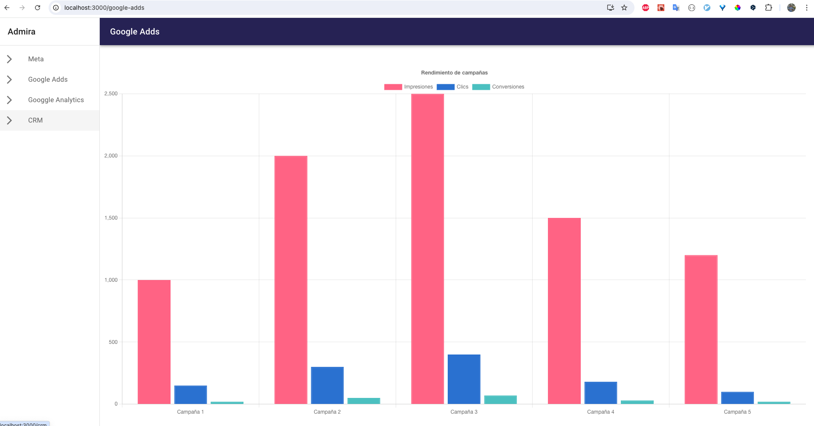
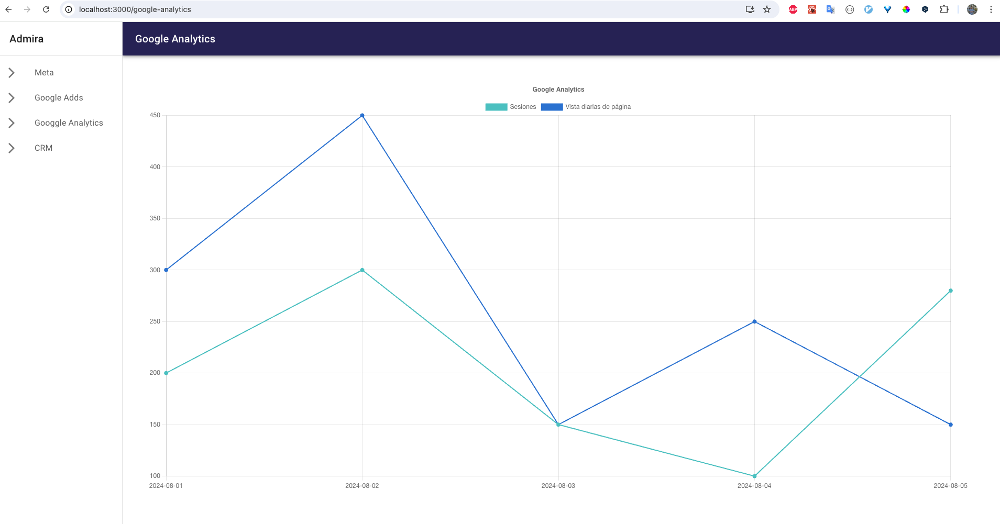
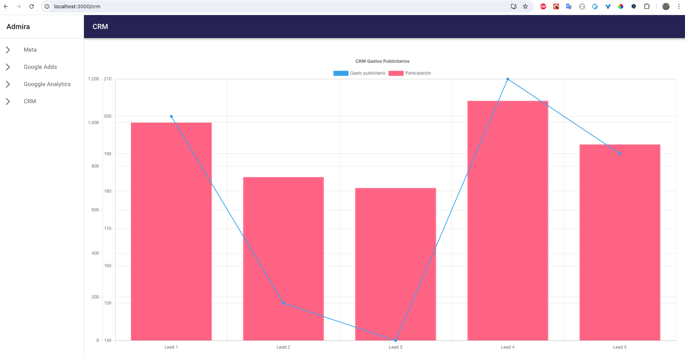
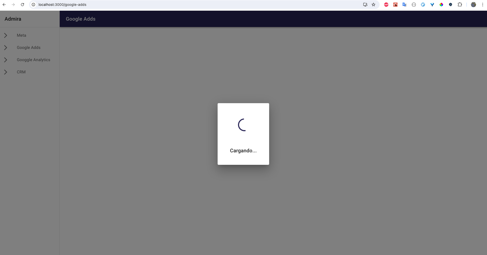
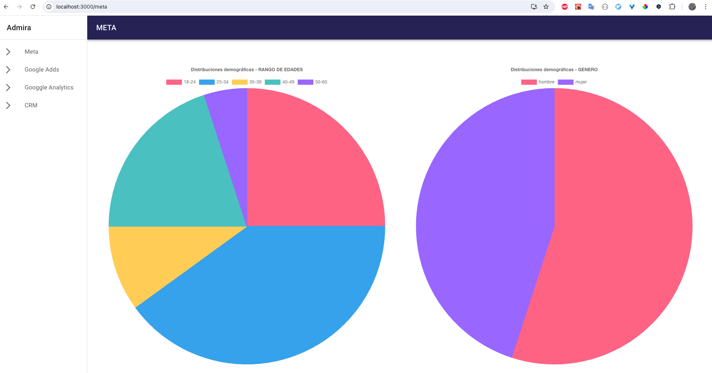
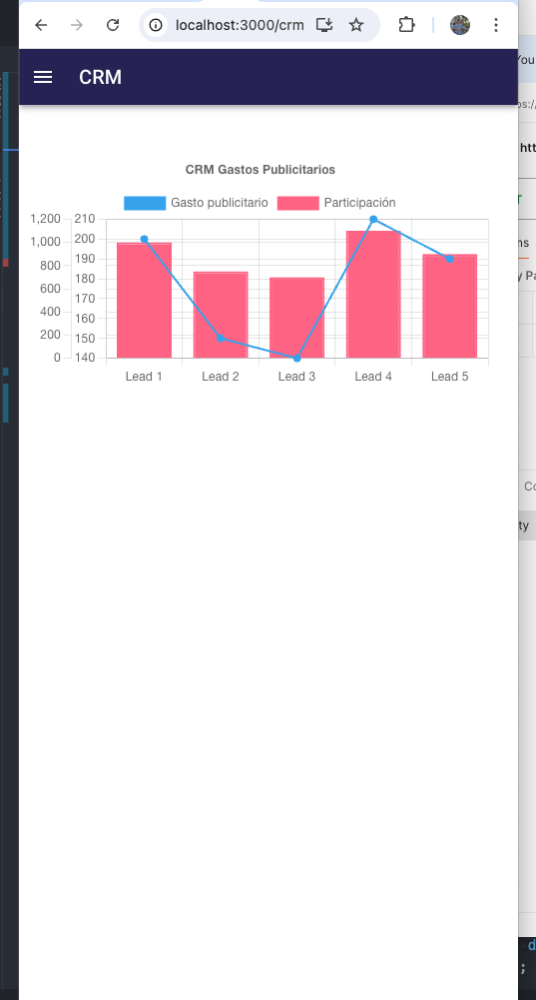

# Prueba técnica ADMIRA

## Para esta prueba técnica decidí resolverla de la siente manera.

- De inicio implemente el patrón de diseño Layout, debido a que la idea es crear un Dashboard por lo cual la mejor manera para crearlo es englobar toda la aplicación en un mismo layout el cúal estarán implementado todas las páginas y de esa forma reutilzar mis componentes.

- Todo el desarrollo de la aplicación lo estuve haciendo con Typescript, por la gran seguridad que me da el tipado de datos.

- Una vez creado mi Layout, decidí dividir las difentes fuentes de datos en páginas/rutas, por lo que cada fuente de datos tiene su propia sección.

- Para la parte de UI implementé Material UI, haciendo que toda la aplicación sea responsiva para difenetes tipos de dispotivos.

- Para las gráficas decidí implementar chart.js y react-chartjs-2 (lo que le permite al usuario una manera muy limpia y amigable de ver los datos e interactuar con ellos, eliminando datos que quisiera oimitir o bien con la ayuda de un tooltip tener información más detallada.).

- En cuanto al manejo de errores en la parte visual implemente sweetAlert2, lo que me permite mostrar modales de error en caso que una petición falle, haciendo que la aplicación luzca más amigable en cuanto al tema de errores se refiere. Además que se implementaron componentes de espera(loaders) mientras las peticiones se completan.

- Para el manejo de erros en cuanto al código se refiere, trabaje con Async/Await lo cual me permite realizar peticiones y detectar de manera más eficiente los errores y de esta manera definir bien mis mensajes de errores.

- Se implementaron diferentes custoom Hooks, tanto para el manejo de peticiones como para el estado de componentes.

## Despliegue del proyecto

- Decidí desplegar el proyecto directo en Vercel, ya que es la manera más rápdida y sencilla
  https://admira-test-beta.vercel.app/

- Para realizar un cambio al proyecto solo es necesario hacer un push al repositorio y vercel automaticamente lo detecta.

# Resultado del proyecto (Imagenes)

## Ejecución de manera local

### Para la ejecución de la aplicación de manera local son los siguinetes pasos.

- Contar con Node JS >= 12
- Una vez dentro de la raiz del proyecto: ejecutar 'npm install'
- Ya completada la instalación de todos nuestros paquetes es necesario: 'npm start'
- Tenemos nuestro proyecto corriendo de manera local
